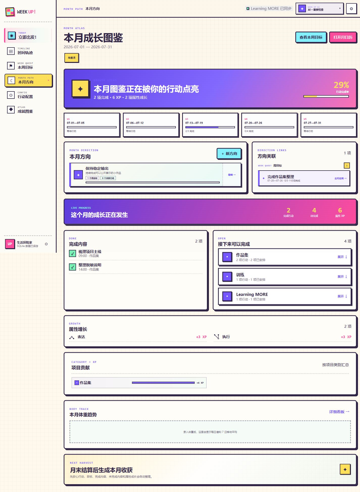
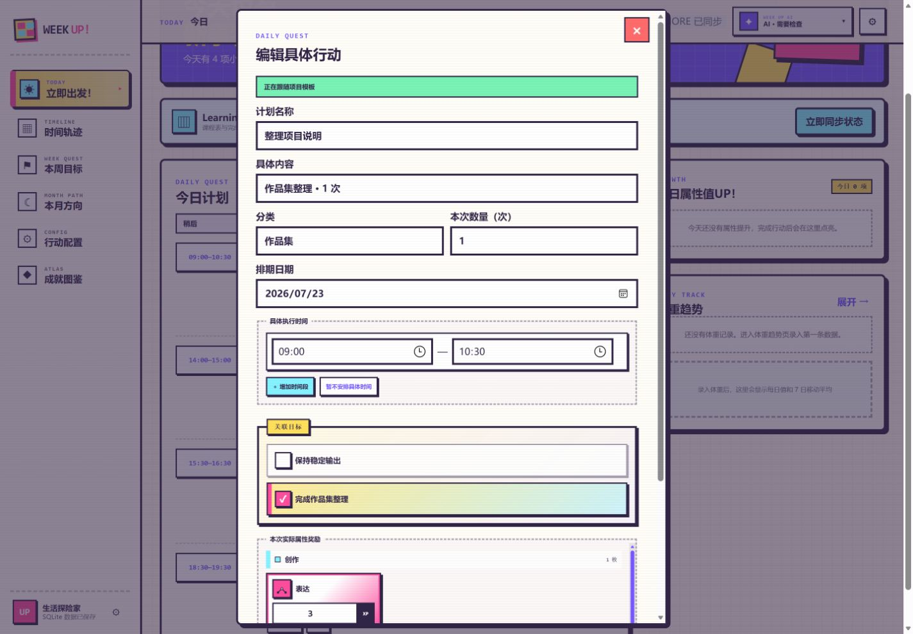
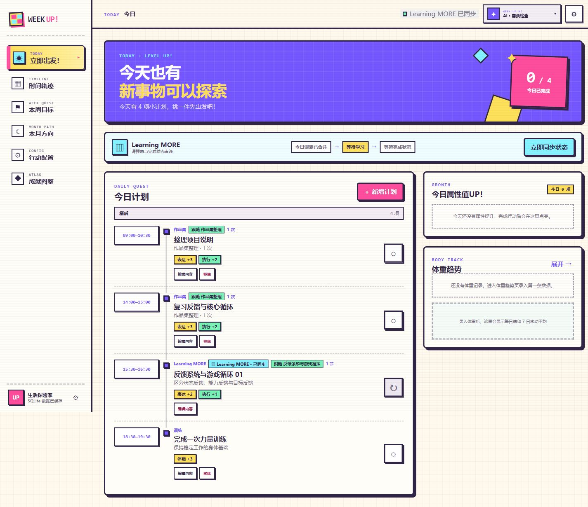
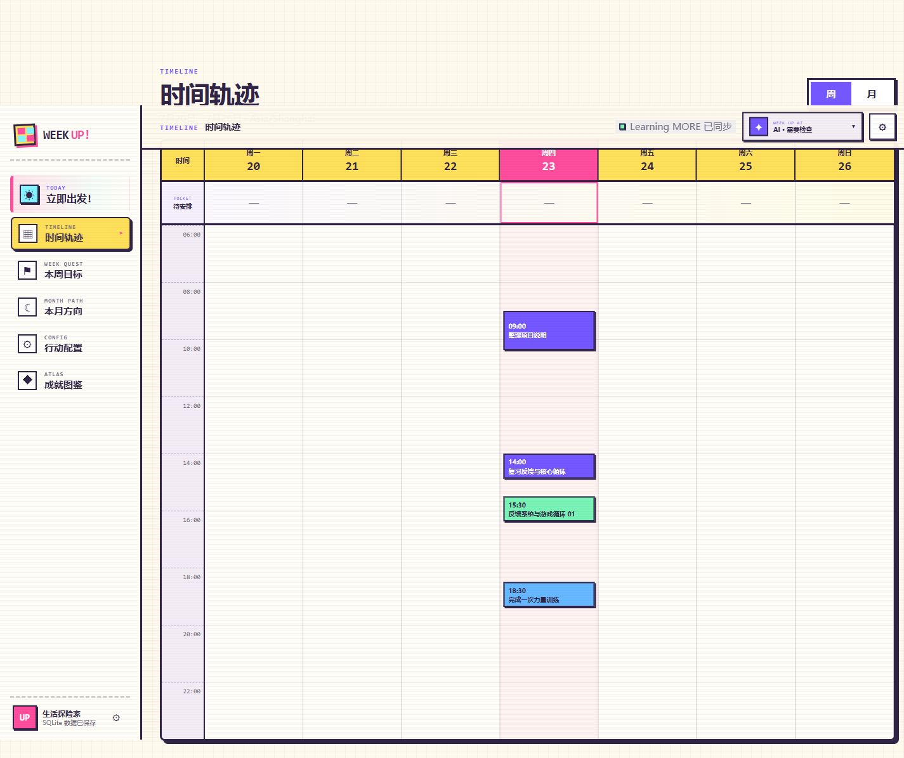
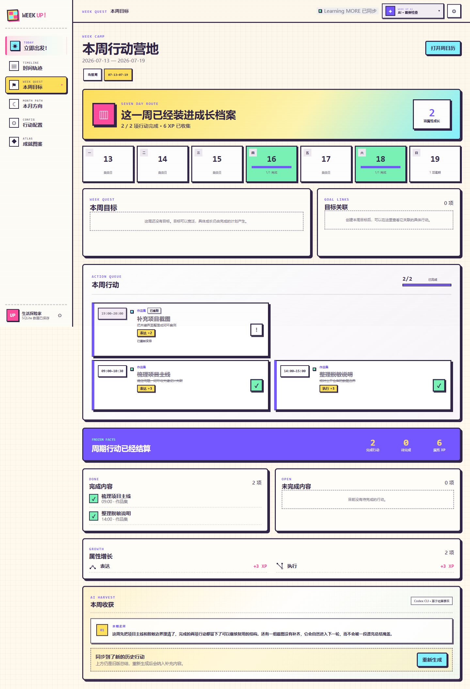
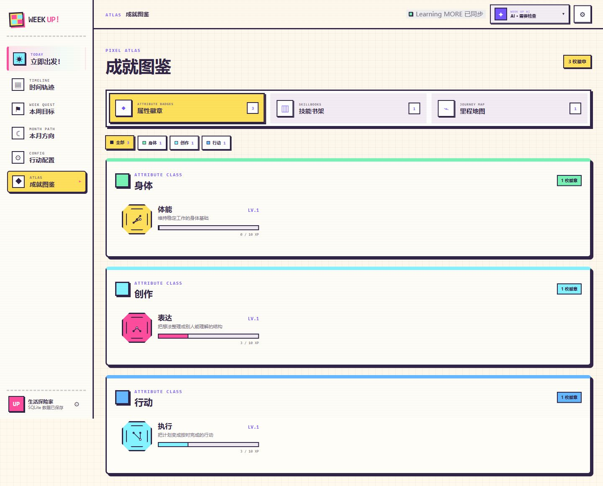
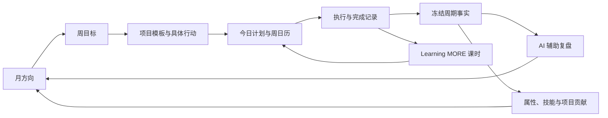

# Week UP

> A local-first weekly planning and review workspace that turns intentions into an actionable growth loop.

Week UP —— 希望做一个让人每天都想主动打开使用的计划与复盘工具。
目前还在使用中持续迭代。

当前公开仓库是经过脱敏、移除原始 Git 历史的作品集快照。截图使用虚构计划和演示数据，不包含真实日程、回顾、体重数据或本地数据库。

## Case study snapshot

| 项目维度 | 设计选择                                                               |
| -------- | ---------------------------------------------------------------------- |
| 使用场景 | 单用户、本地优先的个人计划、执行与周期复盘                             |
| 核心问题 | 计划工具能记录待办，却很难把长期方向、每日行动和真实结果连接起来       |
| 产品闭环 | 月方向 → 周目标 → 具体行动 → 时间安排 → 完成事实 → 周期复盘 → 成长反馈 |
| 我的工作 | 产品定义、交互与状态设计、全栈实现                           |
| 当前状态 | 自用中，持续迭代                                                       |

## The problem

我发现的问题是计划系统里的三个断点：

1. **目标和行动断开。** 月度方向通常停留在一句愿望，每日待办又过于具体，很难回头说明一项行动为什么值得做。
2. **计划和时间断开。** 列表里有任务，不代表它已经进入真实的一天；日期、时段、频率和冲突仍需要另一个系统处理。
3. **完成和复盘断开。** 很多回顾依赖当下记忆或一段 AI 总结，未完成项、属性增长和项目贡献没有稳定事实可依赖。

Week UP 因此不把任务列表当作产品终点，而是围绕“意图如何变成行动，行动如何变成下一轮判断”来组织整个系统。

## Product walkthrough

### 1. 先建立方向，再定义行动



月方向提供较长周期的选择，周目标负责收窄当前重点，具体行动才进入完成统计。三层之间保留显式关联，因此既能从方向追到今天，也能从一项完成记录解释它服务于哪个目标。



行动不是只有标题的待办。它可以来自可复用项目模板，也能单独调整本次数量、时间段、目标关系与奖励。模板负责降低重复配置成本，具体行动保留当次执行的真实差异。

### 2. 把计划放进今天和这一周



今日页只关心此刻可执行的内容：时间、上下文、完成入口和完成后产生的成长。Learning MORE 课程会以同步行动出现，但仍保留来源标识，避免两个产品同时声称自己拥有同一份课程事实。



列表回答“做什么”，日历回答“什么时候做”。周视图把不同来源的行动投射到同一时间轴，未安排内容则留在待安排区，而不是假装一条记录已经成为可执行计划。

### 3. 先结算事实，再形成成长反馈



周期结束后先冻结完成、未完成和 XP 等事实，再让 AI 基于这些事实生成收获。延期不会被一段好看的总结抹掉；它会保留历史状态，并明确进入下一轮。



成长反馈不是独立打卡。属性 XP 来自具体完成行动，技能书与里程地图记录更长期的积累。每一次增长都能回到产生它的行动，而不是由系统凭空奖励。

## Key product decisions

### 目标、模板和行动分层

目标描述“为什么做”，项目模板保存“通常怎么做”，具体行动记录“这一次实际做了什么”。如果把三者合并，修改模板会污染历史行动，目标也会退化成另一个标签；分层后，复用和事实可信度可以同时保留。

### Learning MORE 拥有课时日期，Week UP 拥有执行时段

课程和课时的身份、日期与完成状态由 Learning MORE 负责；Week UP 只为它安排当天的执行时间，并展示同步状态。这个边界避免双向编辑产生冲突，也让同步失败时能够明确知道哪一侧仍然可信。

### 先结算事实，再生成 AI 总结

AI 回顾是解释层，不是数据源。完成数、未完成项、XP 和项目贡献会先被固化，随后才进入总结 Prompt；即使重新生成文案，周期事实也不会变化。

### XP 来源

每个属性增长都来自已完成行动的奖励配置，并保留项目、时间与行动来源，属性面板表达“做过什么形成了增长”，并用游戏化数字增强正反馈。

### SQLite 是正式档案，浏览器缓存只是回退

正式运行以本地 SQLite 为权威数据源，浏览器缓存用于迁移和短期回退。状态加载时会明确显示保存位置，避免用户误以为浏览器里的临时数据已经安全持久化。

## Closed-loop model



系统同时保留计划回路和事实回路：计划可以调整，已经发生的完成记录与周期结算不会被之后的编辑反向改写。

## How the system supports the product

| 产品需要                   | 系统设计                                        |
| -------------------------- | ----------------------------------------------- |
| 目标、模板和行动可独立演进 | 领域模型区分层级身份，投影负责组合页面视图      |
| 时间安排与来源状态一致     | 周期调度、重复规则和 Learning MORE 同步契约     |
| 周期事实不可被总结覆盖     | 结算快照先冻结，AI 回顾只读取事实               |
| XP 和项目贡献可追溯        | 完成事件携带奖励与来源，按属性和项目生成投影    |
| 本地数据可靠保存           | SQLite Repository、自动备份、状态补丁与缓存迁移 |

主要目录：

| Area         | Responsibility                                         |
| ------------ | ------------------------------------------------------ |
| `apps/web/src/app` | 页面、目标与行动交互、状态控制                         |
| `apps/web/src/lib` | 领域模型、计划选择、结算、投影、同步与 Repository 边界 |
| `apps/web/server`  | 本地 HTTP 服务、SQLite 持久化和 AI 回顾服务            |
| `apps/web/src`     | React / Vite 应用入口                                  |
| `apps/web/tests`   | 领域、持久化、同步、调度、回顾和视图投影测试           |
| `docs/product`     | 产品截图与对外展示资料                                 |
| `docs/governance`  | 安全、隐私与脱敏说明                                   |

正式运行数据默认保存在 `%LOCALAPPDATA%\Week UP\data\week-up.sqlite`，自动备份位于 `%LOCALAPPDATA%\Week UP\backups`。这些目录不会进入仓库。

## Quality evidence

Week UP 使用一组与产品风险对应的交付门槛：

- TypeScript 类型检查与 Vite 生产构建；
- Node 内置测试运行器覆盖计划选择、重复规则和状态迁移；
- 项目贡献、属性结算与 XP 来源验证；
- SQLite 持久化、备份和浏览器缓存迁移测试；
- 周期调度、冻结事实与回顾摘要边界测试；
- Learning MORE 日期、完成增量和失败回退契约。

## Quick start

### Requirements

- Node.js `22.13.0` 或更高版本
- npm

### Install and verify

```powershell
cd apps/web
npm ci
npm run typecheck
npm test
npm run build
```

### Start development mode

```powershell
npm run dev
```

### Build and start the local service

```powershell
npm run start
```

### Create a lightweight local deployment package

```powershell
npm run package:local
```

The ZIP is written to `artifacts/local/` at the repository root. It contains the built application and installer only; dependencies, tests, caches, user data, backups, and secrets are excluded.

### Start automatically after Windows login

```powershell
powershell -NoProfile -ExecutionPolicy Bypass -File .\scripts\install-week-up-autostart.ps1
```

安装脚本会为当前 Windows 用户创建登录启动任务，并由隐藏的守护脚本保持本地服务运行。唯一访问入口为 `http://127.0.0.1:4173/`，正式数据仍保存在 `%LOCALAPPDATA%\Week UP`。

## Privacy and sanitized data

这个仓库只包含产品源码、测试、非敏感文档和资产。导出时有意排除了：

- 原始 Git 历史与作者元数据；
- 本地数据库、备份、真实计划、回顾和身体数据；
- AI Provider 配置、环境文件、凭据、密钥和证书；
- 日志、缓存、依赖、构建结果和测试产物。

截图中的目标、行动、课程、属性与复盘均为虚构演示内容。详见 [安全与隐私说明](./docs/governance/security-and-privacy.md) 与 [脱敏报告](./docs/governance/sanitization-report.md)。

## Current boundaries

- 当前面向单用户、本地优先场景，不提供账号体系或云同步。
- AI 回顾是辅助解释，不替代原始执行事实。
- Learning MORE 联动依赖两个本地服务的可用性与数据契约。
- 真实使用中的长期迁移、备份恢复和高密度计划仍在持续验证。

## What I am exploring next

- 让延期、拆分和重新安排在跨周期历史中更容易理解；
- 改进目标进度的表达，减少“完成很多行动却没有推进方向”的错觉；
- 让成长反馈更关注行为证据，而不是单纯累积数值；
- 继续完善两个本地产品之间的离线同步与冲突处理。

## Personal Growth OS

Week UP 是 Personal Growth OS 的目标、计划、执行与周期复盘部分。配套项目 [Learning MORE](https://github.com/mixn1998/learning-more) 负责课程、教学和知识内化；两者共同探索从学习意图到每日行动，再到长期认知与成长反馈的闭环。

## Copyright

Copyright © 2026 mixn1998. All rights reserved.

This repository does not grant an open-source license. Without prior written permission from the copyright owner, you may not copy, modify, distribute, commercialize, or otherwise reuse this project or its source code. Public visibility is provided only for portfolio presentation, technical discussion, and evaluation.

本仓库未授予任何开源许可证。未经版权所有者书面许可，不得复制、修改、分发、商业化或以其他方式复用本项目及其源代码。公开可见仅用于作品展示、技术交流与评估。
